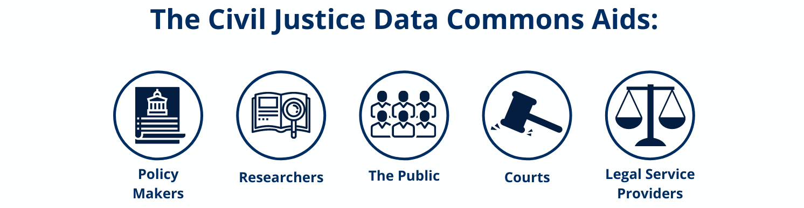

# About the CJDC

## Mission Statement: 

> The Civil Justice Data Commons (CJDC) aims to create a secure, robust repository for civil legal data gathered from courts, legal service providers, and other civil law institutions. CJDC enables stakeholders, researchers, and the public to better understand the civil legal system in the United States. We provide access to court data, focusing on eviction and consumer debt cases, to authorized researchers on a secure data platform.
>

## The CJDC


[Access the Civil Justice Data Commons](https://redivis.com/CJDC)


The CJDC was envisioned to provide access to court-wide, community-wide, and population-level data to understand the prevalence, incidence, and consequences of civil justice problems. Our effort aims to balance the needs and requirements of data contributors (courts, legal service providers) and data users (researchers, civil justice institutions) in a secure and responsible way.

With an easy-to-use, cloud-based interface for discovering and analyzing data, the CJDC empowers researchers, courts, and legal service providers to efficiently identify, access, and analyze civil justice data to enable and accelerate the pursuit of just and equitable outcomes.

