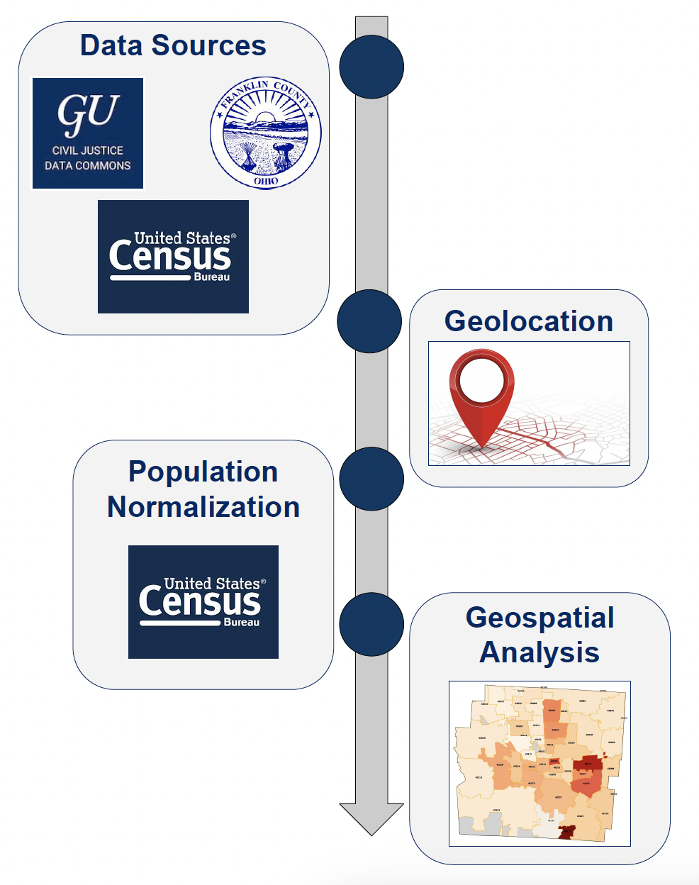
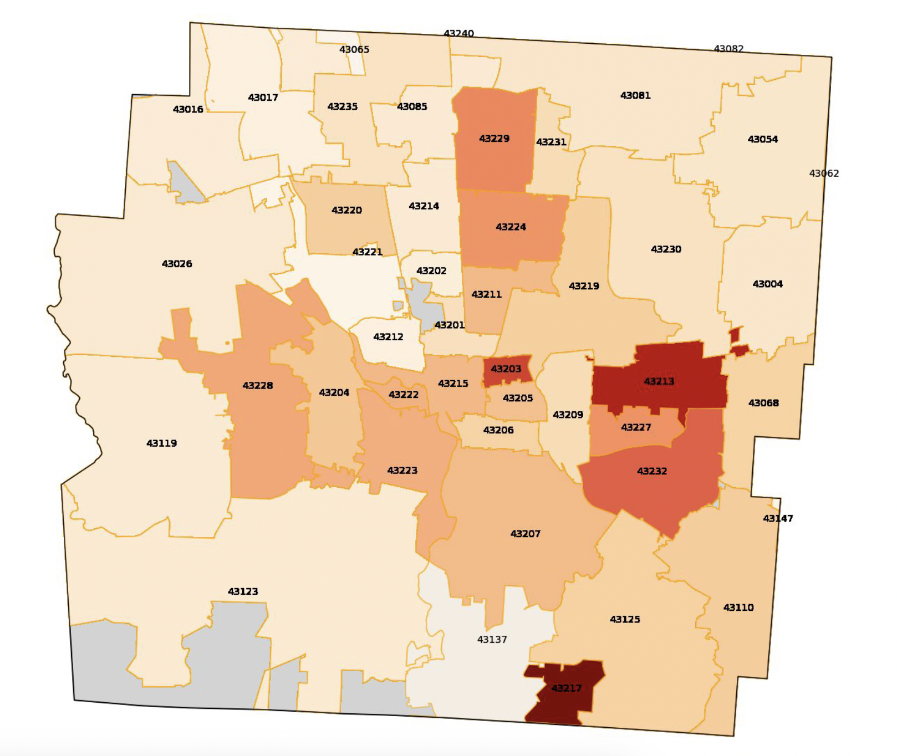

# Analysis

>  This analysis looks to better understand evictions utilizing
the data obtained by the CJDC. Specifically, this study will
look at the top evicting locations within Franklin County, Ohio,
which is the most populous county in the state. **Insights from
this analysis will help individuals better understand
where in Franklin County individuals are being evicted at
the highest per-capita rate.**

## Methodology
The below infographic outlines the technical approach taken in this analysis. 

1. **Data Sources**: data was obtained from three critical sources 
  - CJDC for Eviction Data
  - US Census Bureau for Population Data 
  - Franklin County Government for Geospatial Data
  
2. **Geolocation**: leveraging python to identify where Evictions occurred
  - Merged Geospatial ShapeFiles with Eviction data on zip code to geolocate where evictions were occurring
  - Resulted in a count of evictions by zip code 
3. **Population Normalization**: normalize eviction counts by population to get more representative value
  - Use Census data to normalize the counts 
  - Results in a per-capita eviction rate 
  - Gives viewers a more informative statistic and data point to reference 
4. **Geospatial Analysis**: visualize the results in a geospatial manner
  - Create a heatmap visualization that helps one quickly identify where evictions are happening at the highest per-capita rates

## Results
Evictions obtained from the CJDC database were translated to geolocatable entities at a zip code level and normalized by population in that zip code. The result is a zip code level understanding of evictions. 

- Per-capita evictions most **heavily impacted zip codes with smaller populations**
- Knowledge gained from these results can better aid policy makers and legal experts to better provide aid to these high evicting zip codes

## Limitations
While this methodology works well to understand where in
Franklin County the most evictions are occurring, given the
nature of court data in the United States, this methodology
would likely not translate well to another county. Court data in
the US differs by count system. Other than just the way that
the data is formatted, there is not a guarantee that other court
systems would keep track of geospatial indicators such as zip
codes. Therefore, while this approach is promising,
applications can be limited.

---
## Supplemental Materials
### In-Class Presentation Deck
<iframe src="ANLY 599 HW3 Deliverable.pdf" width="500" height="400"></iframe>

### (Original) MDI Research Poster
<iframe src="MDIScholars_Farris_ResearchPosterTemplateFall2022.pdf" width="500" height="400"></iframe>

### (Updated) HW3 Research Poster
<iframe src="hw3.pdf" width="500" height="400"></iframe>
